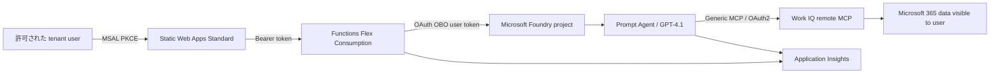

# Work IQ Profile Chat

> 現在の配信対象は**日報・週報のWork IQ版Report Chat**です。`src\report-api`／`src\report-web`を使い、Graph版と同じ`common\reporting`の最終生成指示・モデル設定で比較します。旧`src\api`／`src\web`／プロフィールagentは切り戻し用に保持しています。詳細は[レポート比較の運用](docs/report-comparison.md)を参照してください。以下のプロフィール説明・旧検証コマンドは旧版の説明です。

2026-10-06の日報取得更新では、`verified-workiq-v1` と取得Agent v5を使用します。
予定表はWork IQ `fetch`、Chatは固定英語`ask`＋元メッセージの構造化確認です。
ツール実行前にFunctionが予定引数と承認要求を照合し、期間外・種別不明・システムイベントを通常の日報入力から除外します。
最終生成Agent v2は変更していません。通常Channel投稿・返信の実データ受入、文字起こし、任意規模の全件取得は未確認です。

Azure Static Web Apps、Azure Functions Flex Consumption、Microsoft Foundry Prompt Agent、Work IQ remote MCP を使い、Microsoft 365 の仕事情報からプロフィール、過去90日の活動、観察可能な仕事上の傾向を整理する社内向けチャットです。

## Architecture



Work IQ endpoint は `https://workiq.svc.cloud.microsoft/mcp` です。A2A の `work_iq_preview` は使用しません。

## Security boundary

- Work IQ は signed-in user の delegated permission、Microsoft 365 permission、sensitivity label、information barrier、tenant policy を尊重します。
- Function は App Service Authentication で検証済み bearer token を受け、managed identity-backed FIC を使って Foundry audience への OBO token を取得します。
- 旧プロフィールAgentのallowlistは`ask`だけです。現在の日報取得Agentは`ask/fetch/call_function`を許可し、Functionが計画・引数一致を確認したread taskのみ自動承認します。現profileが計画するのは`ask/fetch`です。create/update/delete/sendは許可しません。
- 他者について取得できるのは、signed-in user が既に閲覧できる organization profile、共有ファイル、参加 chat、受信 email などだけです。
- チャット履歴は browser `sessionStorage` のみです。Foundry/Work IQ/Purview の service retention と audit は各 service policy に従います。

## Project structure

| Path | Purpose |
|---|---|
| `src/web` | React/TypeScript + MSAL UI |
| `src/api` | .NET 10 isolated Functions API |
| `tools/AgentSetup` | Prompt Agent version creation |
| `infra` | Subscription-scope Bicep and AVM modules |
| `scripts` | Entra bootstrap, postprovision, secret rotation |
| `docs` | Architecture, authentication, deployment, operations |

## Local validation

```powershell
dotnet build WorkIqProfileChat.slnx
dotnet test WorkIqProfileChat.slnx --no-build

Push-Location src/web
npm install
npm run build
npm run lint
npm test
Pop-Location

az bicep build --file infra/main.bicep
python tests\infra\test-private-network.py -v
.\tests\infra\test-network-hooks.ps1
.\tests\infra\test-cutover-state.ps1
```

For local Function execution, copy `src/api/local.settings.example.json` to `src/api/local.settings.json` and supply development-only values. Never commit that file or a client secret.

## Deployment

Deployment is intentionally IaC-first and azd-only. See [deployment](docs/deployment.md).

IaCはStorage／Key VaultをPrivate Endpoint経由にし、Web／Function APIの公開入口は維持します。既存環境への適用前に、[閉域化の段階移行と管理経路](docs/private-network.md)を確認してください。VNet用CIDRはIPAM承認済みの値を明示設定し、環境の再作成は行いません。

The required azd environment values are:

```powershell
$env:AZURE_DEV_USER_AGENT = 'microsoft_foundry_skill'
azd env new workiq-profile-chat --no-prompt
azd env set AZURE_SUBSCRIPTION_ID '<subscription-id>'
azd env set AZURE_TENANT_ID '<tenant-id>'
azd env set AZURE_LOCATION 'eastus2'
azd env set AZURE_RESOURCE_GROUP 'workiq_agent_test'
azd env set AZURE_NETWORK_ADDRESS_PREFIX '<approved-vnet-cidr>'
azd env set AZURE_FUNCTION_SUBNET_PREFIX '<approved-function-subnet-cidr>'
azd env set AZURE_PRIVATE_ENDPOINT_SUBNET_PREFIX '<approved-pe-subnet-cidr>'
```

The `preprovision` hook creates the dedicated Entra group and three single-tenant applications idempotently. Bicep stores the Work IQ OAuth secret as a Key Vault ARM child resource. The `postprovision` hook creates the FIC、Foundry connections、production redirect URIs、and a Prompt Agent version.

## Required administrator checkpoints

1. Global Administrator grants tenant-wide admin consent for `WorkIQAgent.Ask`.
2. Microsoft 365 admin enables the Work IQ MCP tenant policy.
3. Tenant owner confirms current Copilot Credits and per-user licensing terms.
4. Two different test users complete the mandatory isolation test before broader release.

## Documents

- [Architecture](docs/architecture.md)
- [Authentication](docs/authentication.md)
- [Deployment](docs/deployment.md)
- [Private network migration](docs/private-network.md)
- [Operations](docs/operations.md)
- [Security and privacy](docs/security.md)
- [Troubleshooting](docs/troubleshooting.md)

## Official references

- [Work IQ MCP overview](https://learn.microsoft.com/microsoft-365/copilot/extensibility/work-iq/mcp/overview)
- [Work IQ MCP tool reference](https://learn.microsoft.com/microsoft-365/copilot/extensibility/work-iq/mcp/tool-reference)
- [Connect Foundry to Work IQ](https://learn.microsoft.com/microsoft-365/copilot/extensibility/work-iq/mcp/quickstart/foundry)
- [Foundry MCP authentication](https://learn.microsoft.com/azure/foundry/agents/how-to/mcp-authentication)
- [Foundry generic MCP tool](https://learn.microsoft.com/azure/foundry/agents/how-to/tools/model-context-protocol)
- [Foundry tracing](https://learn.microsoft.com/azure/foundry/observability/how-to/trace-agent-setup)
- [Microsoft identity OBO flow](https://learn.microsoft.com/entra/identity-platform/v2-oauth2-on-behalf-of-flow)
- [Certificateless Microsoft.Identity.Web](https://learn.microsoft.com/entra/msidweb/authentication/certificateless)
- [MSAL Browser Redirect Bridge](https://learn.microsoft.com/entra/msal/javascript/browser/redirect-bridge)
- [MSAL Browser v4 to v5 migration](https://learn.microsoft.com/entra/msal/javascript/browser/v4-migration)
- [Functions Flex Consumption](https://learn.microsoft.com/azure/azure-functions/flex-consumption-plan)
