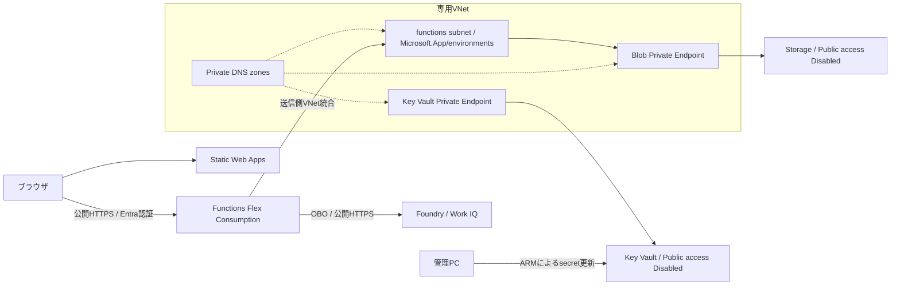

# Storage／Key Vaultの閉域化

この手順は**実装されたIaCの移行手順**です。コードの存在は実環境への適用済みを意味しません。CIDRの承認、Policy、what-if、デプロイ経路の検証を完了してから実行してください。

## 対象と構成

StorageとKey VaultのデータプレーンだけをPrivate Endpoint経由にします。Webサイト・Function API・SCMの公開入口と、Foundry／Work IQ／Entra ID／Monitorへの通信は維持します。利用者にVPNは不要です。



現在のFunctionはKey Vaultを直接参照しません。Key Vault PEは必要時の閉域管理アクセスに使います。Foundry connectionのOAuth secret設定は別の処理であり、Key Vault PEを作っても参照方式は変わりません。

| 構成 | 内容 |
|---|---|
| VNet | 既存Functionと同じリージョン。CIDRは組織IPAMで承認された値を明示指定 |
| functions subnet | Microsoft.App/environmentsへ委任。最小/27、推奨/26。PEと共有しない |
| private-endpoints subnet | 非委任。Blob／vault PEを配置 |
| Private DNS | privatelink.blob.core.windows.net、privatelink.vaultcore.azure.net。VNet linkとzone groupを作成 |
| 認証 | StorageのManaged Identity、RBAC、匿名Blobアクセス禁止、共有キー無効を維持 |
| Key Vault | RBAC、purge protectionを維持。Public access Disabled、network ACL Deny、bypass None。未使用のVM deployment／disk encryption／template secret取得許可は無効 |

この構成はAzure public cloud向けです。Queue／Table／FileのPE、常設VPN／VM、NAT Gateway、Firewall、Private Resolverは作成しません。新しいtriggerや診断機能がこれらのStorageサービスを必要とする場合は、PE・DNS・必要なRBACを追加検討してください。

## 事前確認

1. 対象サブスクリプション／リソースグループと既存リソース名を確認します。リソースを作り直さないでください。
2. VNet／subnetのCIDRについて、IPAM・接続予定のネットワークとの非重複を確認します。コードに未承認CIDRの既定値はありません。
3. Microsoft.NetworkとMicrosoft.Appの登録、ネットワーク作成権限、PE承認権限、継承Policyを確認します。必要な登録は承認後に行います。
4. Storageのホスト用Blobとdeployment containerが同じaccountを使い、Managed Identityが必要RBACを持つことを確認します。
5. 既存アプリのhealth、CORS、認証付きチャット、パッケージ状態、設定値を記録します。秘密値やチャット本文をログに出さないでください。
6. 一時停止を伴うメンテナンスとして実施します。閉域後のパッケージ再デプロイとsecret更新も合格条件です。

## 1. ネットワーク基盤だけを先行作成

`network/azure.yaml`は、ネットワーク専用の独立したazd entrypointです。既存Storage／Key Vault／リソースグループは`existing`参照で、これらの設定や認証・agentを更新しません。`network`にはアプリのprovision hooksもありません。

`network`のazd環境名は別で構いませんが、`PROJECT_ENVIRONMENT_NAME`は**既存アプリのAZURE_ENV_NAMEと完全に一致**させてください。同じ名前・リージョン・CIDRを使うことで、後続の本体IaCと同じネットワークリソースを管理します。

以下はプロジェクトルートから実行する例です。`<...>`は承認・確認済みの値に置き換えます。

```powershell
$env:AZURE_DEV_USER_AGENT = 'microsoft_foundry_skill'
azd -C network env new '<network-bootstrap-environment>'
azd -C network env set AZURE_SUBSCRIPTION_ID '<existing-subscription-id>'
azd -C network env set AZURE_LOCATION 'eastus2'
azd -C network env set AZURE_RESOURCE_GROUP '<existing-resource-group>'
azd -C network env set PROJECT_ENVIRONMENT_NAME '<original-app-environment>'
azd -C network env set AZURE_STORAGE_ACCOUNT_NAME '<existing-function-storage>'
azd -C network env set AZURE_KEY_VAULT_NAME '<existing-key-vault>'
azd -C network env set AZURE_NETWORK_ADDRESS_PREFIX '<approved-vnet-cidr>'
azd -C network env set AZURE_FUNCTION_SUBNET_PREFIX '<approved-function-subnet-cidr>'
azd -C network env set AZURE_PRIVATE_ENDPOINT_SUBNET_PREFIX '<approved-pe-subnet-cidr>'
azd -C network provision --preview
```

プレビューにStorage／Key Vault／Function本体へのwrite、既存リソースの削除、意図しないリージョンが含まれないことを確認してから、`azd -C network provision --no-prompt`を実行します。

完了後、PEの接続状態がApprovedで、Private DNSのAレコードとVNet linkが作られたことを確認します。VNet外のPCでPrivate IPが解決できないこと自体は異常ではありません。

## 2. 対象3リソースだけを切り替え

プロジェクトルートの**元のazd環境**に、同じ3つのCIDRを設定します。

```powershell
azd env set AZURE_NETWORK_ADDRESS_PREFIX '<approved-vnet-cidr>'
azd env set AZURE_FUNCTION_SUBNET_PREFIX '<approved-function-subnet-cidr>'
azd env set AZURE_PRIVATE_ENDPOINT_SUBNET_PREFIX '<approved-pe-subnet-cidr>'
```

移行時は`network/cutover/azure.yaml`を使用します。Functionの`networkConfig/virtualNetwork`、既存Storage、既存Key Vaultのみを更新し、モデル・Foundry project・SWA・アプリ設定・secret値・RBACにはwriteしません。ルート全体のprovisionに、現環境と異なるモデル設定や既定SKUの差分が出る場合に、それらを閉域化と一緒に適用することを避けます。

```powershell
azd -C network/cutover env new '<cutover-environment>' `
  --subscription '<existing-subscription-id>' --location eastus2

.\scripts\set-private-cutover-state.ps1 `
  -SubscriptionId '<existing-subscription-id>' `
  -ResourceGroupName '<existing-resource-group>' `
  -FunctionAppName '<existing-function-app>' `
  -StorageAccountName '<existing-function-storage>' `
  -KeyVaultName '<existing-key-vault>' `
  -FunctionSubnetResourceId '<functions-subnet-resource-id-from-bootstrap>'

azd -C network/cutover provision --preview
```

スクリプトはARMから既存のwritable stateを読み、read-onlyフィールドを除去し、ignored azd環境へ保存します。Base64はazd parameter substitutionの引用符破損を防ぐためのエンコードであり、暗号化ではありません。ARMへの入力はsecure parameterとして扱います。Storageに追加identityがある等、この移行の前提と異なる場合は停止します。

snapshotを古い状態のまま再利用すると、その後の正当な設定変更を上書きする可能性があります。新しいメンテナンスの前に再取得・レビューし、snapshot取得から適用まで同時変更を避けてください。秘密値やaccount keyを取得する処理はありません。

プレビューと事前検証を確認・承認した後、`azd -C network/cutover provision --no-prompt`を実行します。FunctionのVNet統合が先に完了してから、Storage／Key VaultをDisabledへ切り替える依存関係になっています。それでも再起動等による一時停止はあり得ます。

Key Vaultはbypass Noneとするため、`enabledForDeployment`、`enabledForDiskEncryption`、`enabledForTemplateDeployment`もfalseにします。VM向け証明書取得やテンプレートのsecret取得でこれらを使用している場合、この手順をそのまま適用してはいけません。現在のアプリのARM child secret更新とは異なる機能です。

初回構築や全体の定常管理にはルートのIaCを使用します。Storage SKUは既存に合わせてStandard_LRSを明示しています。通常provision時はモデル・RBAC等も含むため、毎回プレビューを確認してください。既存環境の全体再適用でidentity／agent hooksだけを避ける必要がある場合、プロセス限定の`PROFILE_CHAT_NETWORK_MIGRATION=true`を使用できますが、これはBicepのwrite対象を限定する機能ではありません。

## 3. 閉域状態で検証

| 検証項目 | 期待する結果 |
|---|---|
| Storage／Key Vault | Public access Disabled、Ignoreタグ不要 |
| VNet内DNS | 通常のBlob／vault FQDNが対応するPEのPrivate IPに解決 |
| データプレーン | VNet内の許可IDは成功、VNet外の同等権限IDはネットワークで拒否。認証不足を閉域成功の根拠にしない |
| Function | 再起動・コールドスタート後にhealth 200 |
| CORS | OPTIONS /api/chatは204、正しいOriginとauthorization/content-typeを許可 |
| 認証境界 | 未認証のchat／statusは401、許可された2ユーザーは質問・同意継続・回答を取得可能 |
| 再デプロイ | Public accessを戻さず、元のPCからazd deploy apiが完了 |
| secret更新 | 非機微の検証secretで既存ARM更新経路が成功。secret値はログに出さない |
| ガバナンス | Policy／自動化の再評価とIaC再適用後も閉域とAPI正常性を維持 |

azdのFlex実装はSCMへのOneDeployを使用します。Function／SCMを公開したままStorageを閉域化する構成を基本にしますが、**利用中のazd版での実機検証は必須**です。元のPCから通らない場合は、Storageを一時公開するのではなく、承認を得てVNet内の一時的な実行環境を使用します。

`scripts/rotate-workiq-secret.ps1`はARMの`Microsoft.KeyVault/vaults/secrets`を更新するため、既存方式を維持します。`az keyvault secret show/list`やBlob一覧など、データプレーンの直接管理にはVNet到達性と個別RBACが必要です。PEだけで管理者にデータ権限が追加されることはありません。

## 再発防止と切り戻し

- Ignoreタグの繰り返し付与を前提にしません。コードからもStorageのIgnore付与を除去しています。
- NetworkErrorだけでFoundry権限不足と判断せず、health → CORS → OBO → Foundryの順に切り分けます。
- API停止時はPE承認、Private DNS、subnet統合、Storage RBAC、deployment package読み込みを確認します。
- Public accessの再有効化やタグ例外を自動rollbackにしません。必要ならガバナンス承認を取得します。
- Storage／Key Vault／VNetを削除する`azd down`を移行や切り戻しに使用しません。ネットワーク専用azd環境も同じリソースを管理するため、移行後にdownしてはいけません。
- 先行作成・切替の専用環境とルートIaCで、同じリソースを管理することに注意します。二つの環境で異なるCIDRを同時適用せず、将来の全体管理はルートIaCを正としてください。切替snapshotは新しい変更の前に再取得します。

## 追加料金の目安

Private Endpoint 2個とPrivate DNS zone 2個は、USD小売単価・月730時間換算で約15.60 USD/月に、Private Linkのデータ処理・DNS query等が加算されます。既存サービス料金、契約割引、税、監視や一時管理環境の費用は別です。最新単価を再確認してください。

## ローカル検証

Python 3の標準ライブラリ、Azure CLI／Bicep、PowerShell 7を使用します。以下の検証はAzureリソースを変更しません。

```powershell
python tests\infra\test-private-network.py -v
.\tests\infra\test-network-hooks.ps1
.\tests\infra\test-cutover-state.ps1
```

コンパイルしたARM templateで、先行作成のwrite対象、共有ネットワーク定義の一致、閉域設定、認証の維持、CIDR入力の必須化を検証します。hooksは外部CLI呼び出しを禁止した状態で、移行モード・通常モード・不正入力を確認します。これらはAzureのwhat-if／実機試験の代わりではありません。

## 公式資料

- [Flex Consumption VNet統合](https://learn.microsoft.com/en-us/azure/azure-functions/flex-consumption-how-to)
- [FunctionsのStorage用途](https://learn.microsoft.com/en-us/azure/azure-functions/storage-considerations)
- [OneDeployと閉域デプロイ](https://learn.microsoft.com/en-us/azure/azure-functions/functions-deployment-technologies)
- [Key VaultのデータプレーンとARM操作](https://learn.microsoft.com/en-us/azure/key-vault/general/overview-vnet-service-endpoints)
- [Private DNS zone名](https://learn.microsoft.com/en-us/azure/private-link/private-endpoint-dns)
- [Azure Retail Prices API](https://learn.microsoft.com/en-us/rest/api/cost-management/retail-prices/azure-retail-prices)
